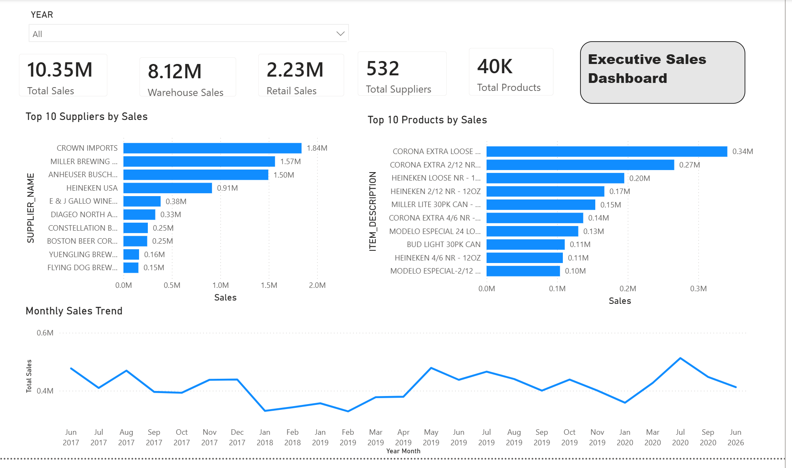

# 🏗️ Sales ETL Pipeline — Python + Oracle

An end-to-end **ETL (Extract, Transform, Load)** pipeline that processes raw sales data from CSV, cleans and normalizes it into a 3NF relational schema, loads it into an Oracle database, and provides a rich SQL analytics layer for business intelligence.

> Built with Python · Pandas · Oracle XE · SQL

---

## 📋 Table of Contents

- [Project Overview](#-project-overview)
- [Architecture](#-architecture)
- [ETL Pipeline](#-etl-pipeline)
- [Database Schema](#-database-schema)
- [SQL Analytics Layer](#-sql-analytics-layer)
- [Project Structure](#-project-structure)
- [Setup & Installation](#-setup--installation)
- [How to Run](#-how-to-run)
- [Technical Notes](#-technical-notes)

---

## 🔎 Project Overview

| Attribute | Details |
|-----------|---------|
| **Source Data** | `sales.csv` — 319,029 rows × 9 columns (~34 MB) |
| **Database** | Oracle XE (21c) with Pluggable Database |
| **Schema** | 3NF — SUPPLIER, ITEM, SALES |
| **Analytics** | 4 Business Views, 30+ Analytical Queries |
| **Domains** | Demand Planning · Supplier Analytics · Warehouse Analytics · Product Analytics |

### Source Data Columns

| Column | Type | Description |
|--------|------|-------------|
| YEAR | Numeric | Sales year |
| MONTH | Numeric | Sales month (1–12) |
| SUPPLIER | Text | Supplier company name |
| ITEM CODE | Text | Product identifier |
| ITEM DESCRIPTION | Text | Product name |
| ITEM TYPE | Text | Product category (WINE, BEER, etc.) |
| RETAIL SALES | Numeric | Retail sales amount |
| RETAIL TRANSFERS | Numeric | Inter-store transfer amount |
| WAREHOUSE SALES | Numeric | Warehouse sales amount |

---

## 🏛️ Architecture

The project follows a layered architecture with clear separation of concerns:

```
┌──────────────────────────────────────────────────────────────────┐
│                     PRESENTATION LAYER                          │
│   Dashboard Queries · Executive KPIs · Analytics Reports        │
├──────────────────────────────────────────────────────────────────┤
│                     ANALYTICS LAYER (SQL)                        │
│   Demand Planning · Supplier · Warehouse · Product Analytics    │
├──────────────────────────────────────────────────────────────────┤
│                     VIEW LAYER (SQL)                             │
│   VW_SALES_DETAILS · VW_MONTHLY_SALES                          │
│   VW_SUPPLIER_PERFORMANCE · VW_PRODUCT_PERFORMANCE             │
├──────────────────────────────────────────────────────────────────┤
│                     STORAGE LAYER (Oracle)                       │
│   SUPPLIER (PK) ──┐                                             │
│   ITEM (PK) ──────┼──→ SALES (FK, FK)                          │
├──────────────────────────────────────────────────────────────────┤
│                     ETL LAYER (Python)                           │
│   Extract (CSV) → Explore → Clean → Normalize → Load (Oracle)  │
├──────────────────────────────────────────────────────────────────┤
│                     SOURCE LAYER                                │
│   sales.csv (319,029 rows · 34 MB)                              │
└──────────────────────────────────────────────────────────────────┘
```

---

## ⚙️ ETL Pipeline

The pipeline executes in five sequential stages:

```
 ╔══════════╗     ╔══════════╗     ╔══════════╗     ╔═════════════╗     ╔══════════╗
 ║ EXTRACT  ║ ──→ ║ EXPLORE  ║ ──→ ║  CLEAN   ║ ──→ ║  NORMALIZE  ║ ──→ ║   LOAD   ║
 ║ CSV Read ║     ║ Profiling║     ║ Transform║     ║  3NF Split  ║     ║  Oracle  ║
 ╚══════════╝     ╚══════════╝     ╚══════════╝     ╚═════════════╝     ╚══════════╝
```

### Stage 1 — Extract (`explore.py`)

Reads the raw CSV file into a Pandas DataFrame.

### Stage 2 — Explore (`explore.py`)

Data profiling to understand quality before transformation:

| Report | Purpose |
|--------|---------|
| Dataset Summary | Row/column count, data types, memory usage |
| Missing Values | Per-column null counts and percentages |
| Distinct Values | Unique value counts per column |
| Duplicate Report | Full-row duplicate detection |
| Special Characters | Accounting negatives `(1,234)`, commas, blanks, invalid chars |
| Key Consistency | Checks if ITEM CODE maps to a single DESCRIPTION/TYPE/SUPPLIER |

### Stage 3 — Clean (`clean.py`)

Transforms sales columns from raw text to numeric:

```
 Raw Value        Transformation           Result
─────────────────────────────────────────────────
 "1,234.56"   →   Remove commas         →  1234.56
 "(500)"      →   Accounting negative   →  -500.0
 ""           →   Blank to NaN          →  NaN
 "abc"        →   Invalid to NaN        →  NaN
```

Post-cleaning validation confirms:
- All sales columns are numeric dtype
- No commas or brackets remain
- Missing values are counted

### Stage 4 — Normalize (`normalize.py`)

Decomposes the flat CSV into **Third Normal Form (3NF)**:

```
                    ┌──────────────────┐
                    │    sales.csv     │
                    │  (flat file)     │
                    └────────┬─────────┘
                             │
               ┌─────────────┼─────────────┐
               ▼             ▼             ▼
      ┌──────────────┐ ┌──────────┐ ┌──────────────┐
      │   SUPPLIER   │ │   ITEM   │ │    SALES     │
      │──────────────│ │──────────│ │──────────────│
      │ SUPPLIER_ID  │ │ ITEM_CODE│ │ YEAR         │
      │ SUPPLIER_NAME│ │ ITEM_DESC│ │ MONTH        │
      └──────┬───────┘ │ ITEM_TYPE│ │ ITEM_CODE(FK)│
             │         └────┬─────┘ │ SUPPLIER_ID  │
             │              │       │   (FK)       │
             └──────────────┴───────│ RETAIL_SALES │
                      referenced by │ RETAIL_TRANS │
                                    │ WAREHOUSE    │
                                    └──────────────┘
```

Validation checks after normalization:
- No duplicate primary keys
- No missing foreign keys
- Row counts per table

### Stage 5 — Load (`oracle_loader.py`)

Inserts normalized DataFrames into Oracle using `oracledb`:
- Handles `NaN → None` conversion for nullable columns
- Uses `executemany()` for batch inserts
- Loads in dependency order: SUPPLIER → ITEM → SALES

---

## 🗄️ Database Schema

### Entity-Relationship Diagram

```
┌──────────────────────┐          ┌──────────────────────────────────┐
│      SUPPLIER        │          │              SALES               │
│──────────────────────│          │──────────────────────────────────│
│ * SUPPLIER_ID  (PK)  │─────┐   │   YEAR             NUMBER  (NN) │
│   SUPPLIER_NAME      │     │   │   MONTH            NUMBER  (NN) │
│   VARCHAR2(200)      │     ├──→│ * SUPPLIER_ID (FK)  NUMBER  (NN) │
└──────────────────────┘     │   │ * ITEM_CODE   (FK)  VARCHAR (NN) │
                             │   │   RETAIL_SALES      NUMBER(12,2) │
┌──────────────────────┐     │   │   RETAIL_TRANSFERS  NUMBER(12,2) │
│        ITEM          │     │   │   WAREHOUSE_SALES   NUMBER(12,2) │
│──────────────────────│     │   └──────────────────────────────────┘
│ * ITEM_CODE    (PK)  │─────┘
│   ITEM_DESCRIPTION   │            PK = Primary Key
│   VARCHAR2(300)      │            FK = Foreign Key
│   ITEM_TYPE          │            NN = NOT NULL
│   VARCHAR2(50)       │
└──────────────────────┘
```

### Constraints

| Constraint | Type | Table | Column(s) |
|------------|------|-------|-----------|
| PK_SUPPLIER | Primary Key | SUPPLIER | SUPPLIER_ID |
| PK_ITEM | Primary Key | ITEM | ITEM_CODE |
| FK_SALES_SUPPLIER | Foreign Key | SALES | SUPPLIER_ID → SUPPLIER |
| FK_SALES_ITEM | Foreign Key | SALES | ITEM_CODE → ITEM |

---

## 📊 SQL Analytics Layer

### Business Views

Four materialized views power the analytics queries:

| View | Purpose | Key Columns |
|------|---------|-------------|
| `VW_SALES_DETAILS` | Denormalized join of all 3 tables | All columns from SALES + ITEM + SUPPLIER |
| `VW_MONTHLY_SALES` | Monthly aggregated totals | YEAR, MONTH, TOTAL_RETAIL_SALES, TOTAL_WAREHOUSE_SALES, TOTAL_SALES |
| `VW_SUPPLIER_PERFORMANCE` | Supplier-level KPIs | SUPPLIER_NAME, PRODUCT_COUNT, TOTAL_SALES |
| `VW_PRODUCT_PERFORMANCE` | Product-level performance | ITEM_CODE, ITEM_DESCRIPTION, TOTAL_RETAIL_SALES, TOTAL_WAREHOUSE_SALES |

> **Note:** `TOTAL_SALES = RETAIL_SALES + WAREHOUSE_SALES`. RETAIL_TRANSFERS represent inventory movement between stores and are excluded from the sales total.

### Analytics Domains

```
┌────────────────────────────────────────────────────────────┐
│                   DASHBOARD QUERIES                        │
│          Executive KPIs · Monthly Trends                   │
│         Top Suppliers · Top Products                       │
├──────────────┬──────────────┬──────────────┬───────────────┤
│   DEMAND     │  SUPPLIER    │  WAREHOUSE   │   PRODUCT     │
│   PLANNING   │  ANALYTICS   │  ANALYTICS   │   ANALYTICS   │
│──────────────│──────────────│──────────────│───────────────│
│ Monthly      │ Top          │ Warehouse vs │ Top/Bottom    │
│  Trends      │  Suppliers   │  Retail      │  Products     │
│ Peak Months  │ Portfolio    │ Contribution │ By Category   │
│ Top/Bottom   │  Size        │  %           │ Avg Sales/    │
│  Products    │ Contribution │ By Item Type │  Product      │
│ By Item Type │  %           │ Top Warehouse│ No-Sales      │
│ Contribution │ Ranking      │  Products    │  Detection    │
│  %           │ Above Avg    │ Retail vs    │ Product Count │
│              │ Retail vs    │  Warehouse   │  by Category  │
│              │  Warehouse   │              │               │
├──────────────┴──────────────┴──────────────┴───────────────┤
│                    BUSINESS VIEWS                          │
│  VW_SALES_DETAILS · VW_MONTHLY_SALES                      │
│  VW_SUPPLIER_PERFORMANCE · VW_PRODUCT_PERFORMANCE         │
├────────────────────────────────────────────────────────────┤
│              ORACLE DATABASE (3NF)                         │
│         SUPPLIER · ITEM · SALES                            │
└────────────────────────────────────────────────────────────┘
```

### SQL Scripts (Execution Order)

| # | Script | Purpose |
|---|--------|---------|
| 01 | `01_create_user.sql` | Create `sales_etl` database user and grant permissions |
| 02 | `02_create_tables.sql` | Create SUPPLIER, ITEM, SALES tables |
| 03 | `03_constraints.sql` | Add primary keys, foreign keys, NOT NULL constraints |
| 04 | `04_validation.sql` | Verify schema structure, constraints, and row counts |
| 05 | `05_demand_planning.sql` | Monthly trends, peak months, top/bottom products |
| 06 | `06_supplier_analytics.sql` | Supplier ranking, portfolio, contribution analysis |
| 07 | `07_warehouse_analytics.sql` | Warehouse vs retail comparison, warehouse contribution % |
| 08 | `08_product_analytics.sql` | Product performance, category analysis, no-sales detection |
| 09 | `09_business_views.sql` | Create the 4 business views |
| 10 | `10_dashboard_queries.sql` | Executive dashboard KPIs and summary queries |

---

## 📁 Project Structure

```
Sales_ETL_Project/
│
├── main.py                        # ETL entry point — runs full pipeline
│
├── src/
│   ├── __init__.py
│   ├── config.py                  # File paths, column lists, DB credentials
│   ├── explore.py                 # Data profiling and exploration reports
│   ├── clean.py                   # Sales column cleaning and validation
│   ├── normalize.py               # 3NF decomposition (SUPPLIER, ITEM, SALES)
│   ├── oracle_loader.py           # Oracle connection and batch inserts
│   └── utils.py                   # Utility functions
│
├── data/
│   └── sales.csv                  # Source data (319,029 rows)
│
├── sql/
│   ├── 01_create_user.sql         # Database user setup
│   ├── 02_create_tables.sql       # Table DDL
│   ├── 03_constraints.sql         # PKs, FKs, NOT NULLs
│   ├── 04_validation.sql          # Schema verification queries
│   ├── 05_demand_planning.sql     # Demand planning analytics
│   ├── 06_supplier_analytics.sql  # Supplier performance analytics
│   ├── 07_warehouse_analytics.sql # Warehouse analytics
│   ├── 08_product_analytics.sql   # Product analytics
│   ├── 09_business_views.sql      # Business view definitions
│   └── 10_dashboard_queries.sql   # Dashboard KPI queries
│
├── requirements.txt               # Python dependencies
└── README.md
```

### Module Responsibilities

```
┌─────────────┐
│  main.py    │  Orchestrates the full ETL pipeline
└──────┬──────┘
       │ imports
       ▼
┌─────────────────────────────────────────────────┐
│                    src/                          │
│                                                 │
│  config.py ─────→ Constants & DB configuration  │
│       │                                         │
│       ▼                                         │
│  explore.py ────→ Extract + Data Profiling      │
│       │                                         │
│       ▼                                         │
│  clean.py ──────→ Data Cleaning & Validation    │
│       │                                         │
│       ▼                                         │
│  normalize.py ──→ 3NF Normalization             │
│       │                                         │
│       ▼                                         │
│  oracle_loader.py → Oracle Insert               │
└─────────────────────────────────────────────────┘
```

---

## 🚀 Setup & Installation

### Prerequisites

- **Python 3.8+**
- **Oracle Database XE** (21c or later) with a Pluggable Database (`XEPDB1`)
- **Oracle Instant Client** (if connecting remotely)

### 1. Clone the Repository

```bash
git clone https://github.com/YOUR_USERNAME/Sales_ETL_Project.git
cd Sales_ETL_Project
```

### 2. Install Python Dependencies

```bash
pip install -r requirements.txt
```

### 3. Set Up Oracle Database

Run the SQL scripts in order using SQL*Plus or SQL Developer:

```sql
-- Connect as SYSDBA
@sql/01_create_user.sql

-- Connect as sales_etl
@sql/02_create_tables.sql
@sql/03_constraints.sql
```

### 4. Configure Connection

Update database credentials in `src/config.py`:

```python
DB_USER = "sales_etl"
DB_PASSWORD = "your_password"
DB_HOST = "localhost"
DB_PORT = 1521
DB_SERVICE = "XEPDB1"
```

---

## ▶️ How to Run

### Run the Full ETL Pipeline

```bash
python main.py
```

This will:
1. Load `data/sales.csv` into a DataFrame
2. Print data profiling reports (missing values, duplicates, special characters)
3. Clean sales columns (accounting negatives, commas, blanks)
4. Normalize into 3NF tables (SUPPLIER, ITEM, SALES)
5. Load all tables into Oracle

### Run SQL Analytics

After loading data, create the business views and run analytics:

```sql
-- Connect as sales_etl
@sql/09_business_views.sql      -- Create views first
@sql/04_validation.sql          -- Verify data loaded correctly
@sql/05_demand_planning.sql     -- Demand planning queries
@sql/06_supplier_analytics.sql  -- Supplier analytics
@sql/07_warehouse_analytics.sql -- Warehouse analytics
@sql/08_product_analytics.sql   -- Product analytics
@sql/10_dashboard_queries.sql   -- Dashboard KPIs
---

## 📊 Power BI Dashboard

The analytics layer is visualized through an interactive Power BI dashboard connected directly to the Oracle business views.

### Executive Sales Dashboard



**Key Insights:**
- **Total Sales: $10.35M** across all channels and periods
- **Warehouse-dominant business** — 78% of sales ($8.12M) flow through the warehouse channel vs 22% retail ($2.23M)
- **Crown Imports** is the leading supplier at $1.84M, followed by Miller Brewing and Anheuser-Busch
- **Corona Extra** dominates the product rankings across multiple pack sizes
- **Seasonal patterns** visible in the monthly trend — with noticeable peaks and troughs indicating demand cycles

### Dashboard Data Sources

| Power BI Page | Oracle View | Concepts Demonstrated |
|---------------|-------------|----------------------|
| Executive Overview | VW_MONTHLY_SALES, VW_SUPPLIER_PERFORMANCE, VW_PRODUCT_PERFORMANCE | S&OP, KPIs |
| Demand Planning | VW_MONTHLY_SALES, VW_PRODUCT_PERFORMANCE | Forecasting, ABC Segmentation |
| Supplier Analytics | VW_SUPPLIER_PERFORMANCE | Spend Analytics, Concentration Risk |
| Warehouse & SKU | VW_PRODUCT_PERFORMANCE, VW_MONTHLY_SALES | SKU Velocity, Throughput |
| Distribution | VW_DISTRIBUTION_ANALYSIS | DRP, Retail Transfers |

---

## 📝 Technical Notes

- **Sales columns** in the source CSV contain accounting-style negatives `(1,234)` and commas — these are cleaned to proper numeric values during the Transform phase.
- **RETAIL_TRANSFERS** are excluded from `TOTAL_SALES` in business views because they represent inventory movement between stores, not revenue.
- **Key consistency checks** run on the raw data (before cleaning) to detect original inconsistencies in the source.
- The Oracle loader handles `NaN → None` conversion explicitly for nullable columns to ensure clean inserts.

---

## 🛠️ Tech Stack

| Component | Technology |
|-----------|-----------|
| Language | Python 3 |
| Data Processing | Pandas |
| Database | Oracle XE 21c |
| DB Driver | python-oracledb |
| SQL | PL/SQL, Views, Window Functions |
| Visualization | Power BI |
